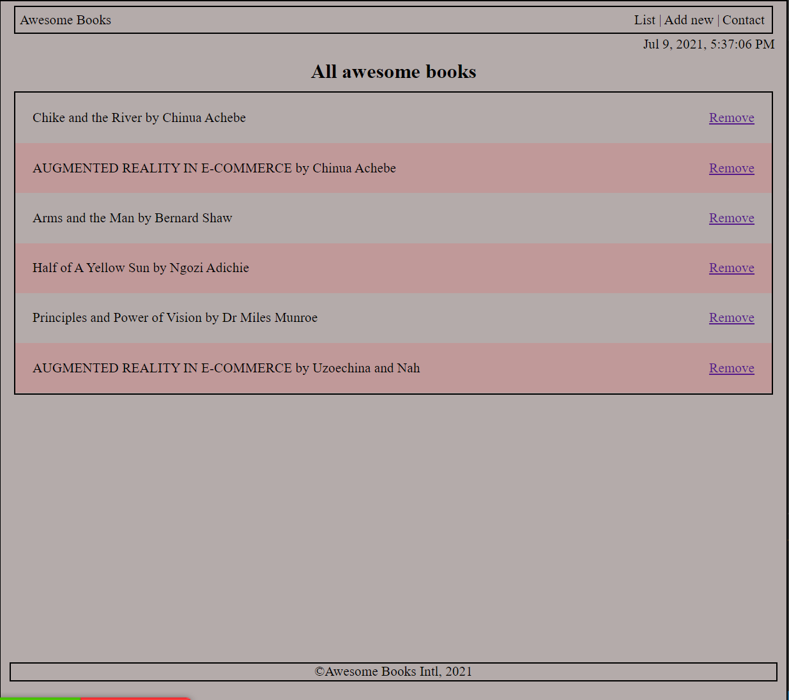
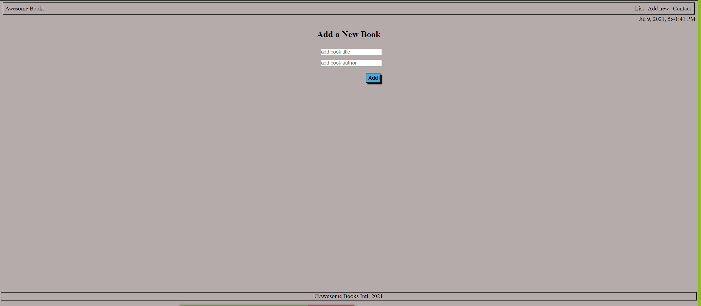
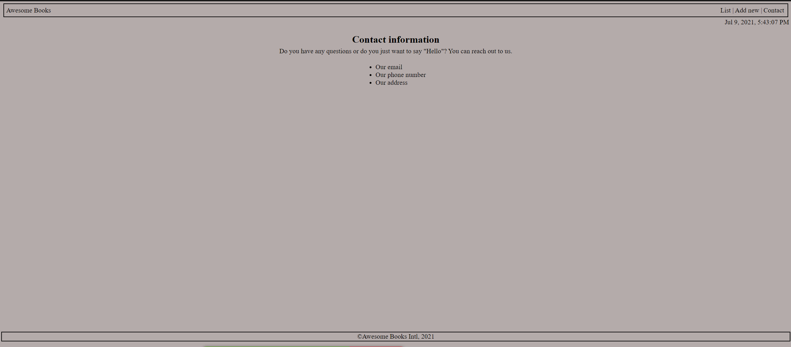

# Awesome Books App

Awesome Books is a basic website that allows users to add/remove books from a list. It provide interface for adding book, for visualizing the list of added books, and for contact information. This is achieved using plain HTML, JavaScript objects, arrays, DOM, and basic events.

## Built With

- HTML
- JavaScript
- Git flow
- GitHub

### Prerequisites

- Terminal (Bash)
- Git
- JavaScript

### Setup: How to start the TicTacToe game

- clone our repo: `https://github.com/Chike1990/Awesome_books`
- cd into: `cd index.html`
- run `index.html`
## Authors

👤 Chukwuma Obasi

- GitHub: [@ccobasi github](https://github.com/eccobasi)
- Twitter: [@obasichux](https://twitter.com/obasichux)

👤 Chibuike Uzoechina

- GitHub: [@Chike1990](https://github.com/Chike1990)
- Twitter: [@ChibuikeUzoechi](https://twitter.com/ChibuikeUzoechi)
- LinkedIn: [@Chibuike-Uzoechina](https://www.linkedin.com/in/chibuike-uzoechina-630857102)

## 🤝 Contributing

Contributions, issues, and feature requests are welcome!

Feel free to check the [issues page]

## Show your support

Give a ⭐️ if you like this project!

## Acknowledgments

- Many thanks to Microverse
- friends
- our standup team

## 📝 License

This project is [MIT](LICENSE) Licensed.
